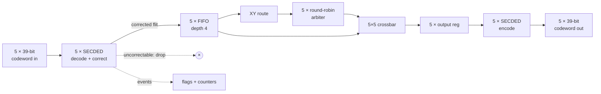

# AegisNoC — a self-healing network-on-chip router for reliable SoCs

**AegisNoC is a 5-port mesh NoC router that corrects single-bit packet corruption in hardware *before* routing, detects and drops double-bit corruption, and arbitrates fairly. It is built twice, once plain and once protected, so the silicon cost of resilience can be measured rather than guessed.**

ChipCraft 3.0 flow: RTL → verification → synthesis → netlist → place & route → layout.

## Status

| Stage | State | Evidence |
|---|---|---|
| RTL (9 modules + 1 package, SystemVerilog) | ✅ done; `verilator -Wall` reports 0 warnings on both tops | `rtl/` |
| Simulation (7 testbenches, 10 configurations, Verilator + Icarus) | ✅ all pass | `reports/sim/summary.rpt` |
| Testbench strength (mutation) | ✅ 26/26 injected bugs caught | `reports/sim/mutation.rpt` |
| Formal (k-induction + exhaustive ECC) | ✅ 26/26 checks: proofs, reachability, negative controls | `reports/formal/summary.rpt` |
| Synthesizability gate (Yosys) | ✅ both tops: no latches, multi-drivers or loops | `reports/yosys/*/summary.rpt` |
| Logic synthesis (Synopsys DC) | ⏳ scripts ready, **not run yet** (needs the organizer machine and library) | `syn/` |
| Place & route (Synopsys ICC2) | ⏳ flow ready, **not run yet** (needs the organizer PDK) | `pnr/` |
| Measured PPA comparison | ⏳ generated automatically from the DC/ICC2 reports | `docs/results.md` |

Live build log: [`docs/BUILD_STATUS.md`](docs/BUILD_STATUS.md).

## The problem

A NoC carries every byte that moves between cores, caches and accelerators. Links and buffers are exposed to soft errors (particle strikes), crosstalk and supply noise.

A flipped **payload** bit silently corrupts data. A flipped **header** bit is worse: the packet goes to the wrong place. It may be lost, may deadlock the network, or may deliver data to a core that should never see it.

Router-level ECC catches the fault at the hop where it happens, before it is routed or spreads.

## Architecture



The FIFO → route → arbiter → crossbar → output-register chain is `router_core`. It is **identical** in `baseline_noc` and `aegis_noc`, so the synthesis difference between the two tops is exactly the ECC and its diagnostics.

| Item | Choice |
|---|---|
| Ports | N, S, E, W, LOCAL; valid/ready on every channel |
| Flit | 32 bits: `[31:30]` dst_x, `[29:28]` dst_y, `[27:0]` payload (4×4 mesh; the tile defaults to (1,1)) |
| Routing | Deterministic XY: X grows EAST, Y grows NORTH (deadlock-free on a mesh) |
| Buffering | 4-flit FIFO per input, plus a registered output stage |
| Arbitration | Round-robin per output; rotates only when a grant is consumed |
| ECC | SECDED Hamming(38,32) + overall parity = 39-bit codeword (r = 6 is the smallest r with 2^r ≥ m+r+1) |
| Timing | 2-cycle latency, 1 flit/cycle/output, no combinational input→output path |

Details: [`docs/architecture.md`](docs/architecture.md).

## Key features

- **Corrects before routing.** The decoder sits in front of the FIFO, so routing only ever sees corrected headers. Demo B2 shows a plain router sending a header-corrupted flit out of the wrong port, while AegisNoC delivers it correctly.
- **Never routes on garbage.** Double-bit (uncorrectable) flits are consumed, dropped and counted.
- **Observable.** `single_error_corrected` and `double_error_detected` pulse, and there are two 32-bit counters. Several ports hit in the same cycle are all counted.
- **Fair.** Starvation freedom is *proven*: a waiting requester is passed over at most 4 times, and the bound is tight.
- **Built for the flow.** Single clock, synchronous reset, flop-driven outputs, and no latches, modulo, division or reset memories.

## Quick start (any machine with the open-source tools)

```bash
brew install verilator icarus-verilog yosys   # or your distro's packages
scripts/run_demo.sh          # the live fault-injection demo (~1 s)
scripts/run_all.sh --quick   # lint + all sims + Yosys + sampled formal (~3 min)
scripts/run_all.sh           # everything, exhaustive formal and mutation (~15 min)
```

Individual steps:

```bash
scripts/run_unit_tests.sh                 # all testbenches on Verilator + Icarus
scripts/run_unit_tests.sh tb_ecc          # one testbench
python3 scripts/mutation_check.py         # prove the testbenches catch injected bugs
python3 scripts/run_formal.py             # formal proofs (Yosys sat)
scripts/run_yosys.sh aegis_noc            # synthesizability gate
python3 scripts/collect_results.py        # regenerate docs/results.md from reports/
```

## Synthesis and P&R (organizer machine, Synopsys)

```bash
export AEGIS_LIB_SETUP=/path/from/organizers/dc_setup.tcl
TOP=baseline_noc dc_shell -f syn/synth.tcl | tee syn/dc_baseline.log
TOP=aegis_noc    dc_shell -f syn/synth.tcl | tee syn/dc_aegis.log

cp pnr/setup_template.tcl pnr/setup_local.tcl   # fill it from organizer material
TOP=aegis_noc icc2_shell -f pnr/flow_template.tcl | tee pnr/icc2_aegis.log

python3 scripts/collect_results.py              # fills docs/results.md
```

No library, PDK or tool path is hard-coded anywhere; both flows refuse to run until they are provided. See [`syn/README.md`](syn/README.md) and [`pnr/README.md`](pnr/README.md).

## Fault-injection demo

`scripts/run_demo.sh` prints the demo. An excerpt of real output:

```text
  [Demo B] Single-bit corruption in the payload
  Original flit          : 0xdeadbeef
  Injected fault bit     : 12  (payload bit 12)
  Corrupted flit on wire : 0xdeadaeef
  ECC syndrome           : 010010  (= Hamming position 18)
  Single error corrected : YES
  Double error detected  : NO
  Exit port              : EAST
  Received flit          : 0xdeadbeef
  RESULT                 : PASS

  [Demo B2] Single-bit corruption in the ROUTING HEADER (bit 31 = dst_x MSB)
  Corrupted flit         : 0x5eadbeef  -> header now says x=1, y=1
  BaselineNoC (no ECC)   : exits LOCAL with flit 0x5eadbeef   <-- MISROUTED + CORRUPT
  AegisNoC  (SECDED)     : exits EAST  with flit 0xdeadbeef   <-- header corrected before routing
```

The full demo also covers a clean packet, a double-bit fault that is detected and dropped, round-robin contention (`N W L N W L …`), all 39 codeword bits end to end, a 5-port simultaneous hit and a stall. The walkthrough is in [`docs/demo_script.md`](docs/demo_script.md).

## Verification

| What | How | Result |
|---|---|---|
| FIFO | Directed tests for every PRD case + 20k random cycles vs a model; formal P1–P8 | pass · proven (k=2) |
| XY routing | All 256 coordinate combinations; formal R5 | pass · proven |
| Arbiter | Contention, backpressure, 20k random, bounded wait; formal A1–A7 incl. starvation freedom | pass · proven (k=2) |
| Crossbar | All 7,776 select patterns; formal R6 | pass · proven |
| Router end-to-end | 16,480 flits: latency, 25 pairs, parallel outputs, backpressure, fairness, random; formal R1–R9 | pass (both tops) · proven (k=2) |
| ECC | 269 patterns × all 39 single flips + all 741 double flips vs an independent model; formal E1–E6 for **all 2³² data** | pass · proven |
| Hero fault injection | Demos A–D, 39-bit sweep, double sweep, burst, stall, exact counters | pass |
| Testbench strength | 26 injected RTL bugs | 26/26 caught |

Method, property list and caveats: [`docs/verification.md`](docs/verification.md).

## Results: BaselineNoC vs AegisNoC

**Pending.** The measured area, timing and power comparison is produced by `scripts/collect_results.py` directly from the Synopsys DC and ICC2 reports, as soon as those runs exist. No PPA number is published before then. Overhead is computed as `(aegis − baseline) / baseline × 100`.

| Metric | BaselineNoC | AegisNoC | Overhead |
|---|---|---|---|
| Total cell area | pending DC | pending DC | — |
| Combinational / sequential area | pending DC | pending DC | — |
| Cell count | pending DC | pending DC | — |
| Critical path (in2reg / reg2reg / reg2out) | pending DC | pending DC | — |
| Worst slack / derived Fmax | pending DC | pending DC | — |
| Post-route timing, utilization, DRC | pending ICC2 | pending ICC2 | — |
| Single-bit faults corrected | 0 of 39 positions | 39 of 39 (proven, all data) | — |
| Double-bit faults detected | 0 | 741 of 741 pairs (proven, all data) | — |

Full table: [`docs/results.md`](docs/results.md).

## Physical design

| AegisNoC routed layout | BaselineNoC routed layout |
|---|---|
| `docs/images/aegis_layout.png` (pending ICC2) | `docs/images/baseline_layout.png` (pending ICC2) |

## Limitations

- **Protected region.** ECC covers the links: the decoder sits at the input and the encoder at the output. FIFO storage holds corrected 32-bit flits, so an upset *inside* a buffer is not covered.
- **Triple-bit errors** are beyond the SECDED guarantee. About 30% are flagged and about 70% are mis-corrected, as measured in `tb_ecc`, which is standard for Hamming plus parity.
- **Uncorrectable flits are dropped**, not retransmitted. Recovery is left to a higher layer, using the flag and counter.
- **One router tile** is verified and implemented. A mesh of tiles hasn't been simulated.
- Counters wrap around at 2³² rather than saturating.
- Power figures, when they arrive, will be vectorless estimates.

## Future work

- Decode at the FIFO head so buffer storage is protected too; this costs 7 more bits per entry.
- A multi-tile mesh testbench with end-to-end fault campaigns.
- Gate-level simulation of the DC netlist, and power with SAIF switching activity.
- A parameter sweep of FIFO depth and flit width versus overhead.
- Link-level retransmission on uncorrectable errors (deliberately out of scope for the hackathon).

## Repository layout

```text
rtl/      aegis_pkg, sync_fifo, xy_route, rr_arbiter, crossbar_5x5, router_core,
          ecc_secded_encoder, ecc_secded_decoder, baseline_noc, aegis_noc
tb/       tb_fifo, tb_xy_route, tb_rr_arbiter, tb_crossbar, tb_router, tb_ecc,
          tb_aegis_fault_injection, ecc_ref_model.svh
formal/   fifo_, arbiter_, router_, ecc_properties.sv
scripts/  run_all.sh, run_unit_tests.sh, run_demo.sh, run_yosys.sh,
          run_formal.py, mutation_check.py, collect_results.py
syn/      synth.tcl, constraints.sdc, README.md          (Synopsys DC)
pnr/      flow_template.tcl, setup_template.tcl, README.md (Synopsys ICC2)
reports/  sim/, formal/, yosys/, baseline/, aegis/       (generated)
docs/     architecture, verification, results (generated), demo_script, BUILD_STATUS
```
