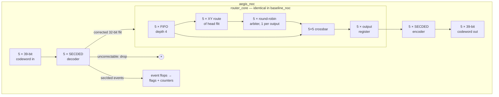

# AegisNoC architecture

## 1. Overview

AegisNoC is one router tile for a 2D mesh network-on-chip. It has five ports (NORTH, SOUTH, EAST, WEST, LOCAL) and works in a single clock domain with a synchronous active-high reset.

There are two top-levels. They share the same `router_core` instance with identical parameters:

| Top | Channel width | Adds |
|---|---|---|
| `baseline_noc` | 32-bit logical flit | nothing |
| `aegis_noc` | 39-bit SECDED codeword | 5 input decoders, 5 output encoders, error flags, two 32-bit error counters |

Because the router is identical, the synthesis difference between the tops *is* the cost of the protection.



The same datapath as ASCII:

```
            +--------------------------- router_core ----------------------------+
 in[p] ---->| FIFO(4) --head--> xy_route --req--> rr_arbiter[o] --grant--+       |
 (valid/    |    |                                                       v       |
  ready)    |    +--------------------------head------------------> crossbar --> out_reg[o] |--> out[o]
            +------------------------------------------------------------------------+
 aegis_noc:  decoder[p] before the FIFO (correct / drop)      encoder[o] after out_reg[o]
```

## 2. Formats

**Logical flit (32 bits):** `[31:30] dst_x`, `[29:28] dst_y`, `[27:0] payload`.

Coordinates are 2 bits each, giving a 4×4 mesh. X grows toward EAST and Y grows toward NORTH. The default tile is (1,1), from which all five directions are reachable.

**Protected channel (39 bits, AegisNoC only):** `[38] P_overall`, `[37:32] p[5:0]`, `[31:0] flit`.

This is a systematic SECDED Hamming(38,32) code plus overall parity:
- **r = 6** is the smallest r with 2^r ≥ 32 + r + 1. With r = 5, 32 < 38 fails; with r = 6, 64 ≥ 39 holds.
- Parity bits sit at Hamming positions 1, 2, 4, 8, 16 and 32. Data bits fill the other positions from 3 to 38.
- `aegis_pkg.sv` documents the parity masks and the full syndrome table.

| Overall check q | Syndrome s | Meaning | Action |
|---|---|---|---|
| 0 | 0 | clean | pass through |
| 1 | 0 | overall parity bit flipped | corrected (data intact) |
| 1 | 2^j | check bit p[j] flipped | corrected (data intact) |
| 1 | pos(d_i) | data bit d_i flipped | d_i inverted |
| 1 | > 38 | odd multi-bit error | uncorrectable |
| 0 | ≠ 0 | double-bit error | uncorrectable |

## 3. Handshake

Every input and output channel uses **valid/ready**. A transfer happens on a rising edge where `valid && ready`. The sender must hold valid and data stable until the flit is accepted.

- `in_ready[p] = !fifo_full[p]`. It never depends on `in_valid` or on the data.
- `out_valid[o]` and `out_data[o]` come straight from flops, so they are stable while stalled by construction.
- No combinational path runs from any input port to any output port. DC checks this with the `in2out` path group.

**Latency:** 2 cycles from input acceptance to output valid (FIFO write, then output-register load).

**Throughput:** 1 flit per cycle per output with `out_ready` held high. All 5 outputs can transfer in the same cycle.

**Buffering:** each input holds 4 flits in its FIFO. Under backpressure, one input can have 5 flits in flight: 4 in the FIFO plus 1 in the output register.

## 4. Micro-architecture

| Block | Implementation | Why |
|---|---|---|
| `sync_fifo` | Register array, 2-bit read and write pointers, 3-bit count; power-of-two depth; show-ahead read | Pointers wrap with a plain increment, so there is no modulo logic. The storage array is not reset, because it is never observed while the FIFO is empty. |
| `xy_route` | Four unsigned compares | Dimension-ordered routing, which is deadlock-free on a mesh |
| `rr_arbiter` | Masked priority: `req & ~(req-1)` isolates the lowest set bit | No modulo logic. The pointer moves to one past the winner, only when the grant is consumed. |
| `crossbar_5x5` | AND-OR mux per output | No priority chain. Relies on each output's select being one-hot-or-zero, which is formally proven. |
| Output stage | 1 register per output; loads when `!out_valid \|\| out_ready` | Stable outputs and clean I/O timing for P&R |
| `ecc_secded_encoder` | 6 XOR trees plus overall parity | Pure combinational logic |
| `ecc_secded_decoder` | 6 syndrome XOR trees, overall parity, 32 column comparators, XOR correction | Pure combinational logic |
| Diagnostics | Per-port event flops, then popcount and 32-bit adders | The 1-cycle lag keeps counters off the input decode path |

## 5. ECC boundary

The ECC boundary follows PRD §6:
- **Decode and correct at each input, before the FIFO.** Routing therefore only ever sees corrected header bits. Demo B2 shows why this matters: a single flipped header bit sends the baseline router's flit out of the wrong port.
- **Drop uncorrectable flits.** The handshake completes, but the flit is never pushed into a FIFO, and it is counted. A corrupted header is never routed.
- **Re-encode at each output**, after the output register, so the next hop receives a protected codeword.

A trade-off comes with this choice: the FIFO storage holds corrected 32-bit flits, so an upset *inside* a FIFO is not covered. Protecting storage would mean decoding at the FIFO head, which adds 7 bits per entry and puts the decoder on the router's reg2reg path. That is listed as future work.

## 6. Error observability (`aegis_noc` outputs)

| Output | Meaning |
|---|---|
| `single_error_corrected` | 1-cycle pulse, one cycle after at least one accepted flit was corrected |
| `double_error_detected` | 1-cycle pulse, one cycle after at least one accepted flit was uncorrectable (and dropped) |
| `corrected_error_count[31:0]` | Total corrected flits. Counts several per cycle when several ports are hit. Wraps around. |
| `uncorrectable_error_count[31:0]` | Total dropped flits. Wraps around. |

Only *accepted* flits are counted. A faulty flit held under backpressure counts once. Junk on an input with `in_valid` low never counts. Both behaviours are verified.

## 7. Synthesis-safety rules followed

- Single clock, synchronous reset, no latches. Yosys asserts zero latches and DC aborts if it infers any.
- No multi-driven nets, no combinational loops, no `initial` blocks in the RTL, no delays.
- Only statically bounded `for` loops; no division or modulo in the datapath.
- Packages hold `localparam`s only. The RTL uses qualified `aegis_pkg::NAME` references because the Yosys frontend rejects `import`.
- Top-level ports are flat vectors: port p occupies `[p*W +: W]`.
- Formal properties are included only under `` `ifdef FORMAL ``, which synthesis never defines.
